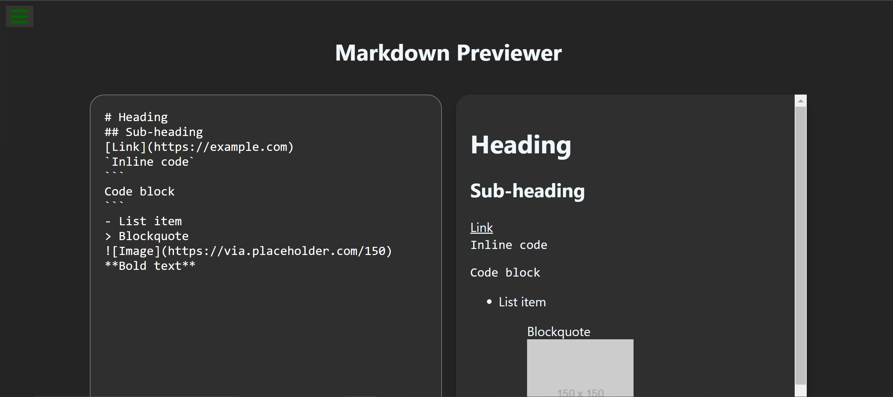

# build-markdown-previewer 🚀

## Project Description 📝

>
### Project Description

This Markdown Previewer is a React-based web application that allows users to input GitHub-flavored Markdown text and see a live preview of the rendered HTML. The application includes a text editor where users can type Markdown and a preview section that updates in real-time to show the corresponding HTML output. It uses the `marked` library to parse the Markdown and render it as HTML. This project meets all specified user stories, including displaying default Markdown content on load and interpreting various Markdown elements such as headings, links, inline code, code blocks, lists, blockquotes, images, and bold text. The user interface is simple and responsive, providing an intuitive experience for exploring Markdown syntax.
>

## User Stories

1. I can see a `textarea` element with a corresponding `id="editor"`.
2. I can see an element with a corresponding `id="preview"`.
3. When I enter text into the `#editor` element, the `#preview` element is updated as I type to display the content of the `textarea`.
4. When I enter GitHub flavored markdown into the `#editor` element, the text is rendered as HTML in the `#preview` element as I type.
5. When my markdown previewer first loads, the default text in the `#editor` field contains valid markdown representing various elements (heading, subheading, link, inline code, code block, list item, blockquote, image, and bolded text).
6. When my markdown previewer first loads, the default markdown in the `#editor` field is rendered as HTML in the `#preview` element.

## Demo 📸

life demo link [(https://farwamuhibzada.github.io/Pokemon-Search-App/)]





## Technologies Used 🛠️

List the technologies or tools that i used to develop this project. 
- CSS
- React


## Installation 💻

for using this project you neet to install 3 things:

- chrombrowser
- an IDE like vscode
- git
- node JS


## Usage 🎯

for using this project you need to know a few commond first clone the repositry in yor local machine then go to the github directory . open the project on your IDE like vscode and start working on it .


go to the cmd and clone the Technical Documentation Page 
using this commond:
```bash

git clone https://github.com/FarwaMuhibZada/build-markdown-previewer/.git 
```
go to the githu directory:
```bash

cd>build-markdown-previewer

```
open the project on your IDE like vscode :

```bash

cd> code .

```
Install the dependencies:

```bash
npm install
```

Start the development server:

```bash
npm start

```
Open your browser and navigate to:
```bash
http://localhost:3000

```


## Features ⭐
- **Real-time Preview**: As you type Markdown in the editor, the preview updates instantly, showing the rendered HTML output.
- **Markdown Parsing**: Supports GitHub-flavored Markdown, allowing you to use headings, subheadings, links, inline code, code blocks, lists, blockquotes, images, and bold text.
- **Default Content**: On initial load, the editor contains default Markdown text that demonstrates the use of various Markdown elements.
- **User-friendly Interface**: Simple and intuitive layout with a clear separation between the editor and preview sections.
- **Responsive Design**: Ensures the app is usable and looks good on different devices and screen sizes.
- **Syntax Highlighting**: Code blocks are rendered with proper syntax highlighting for better readability (if syntax highlighting library is integrated).
- **Customizable Style**: Easy to customize the appearance using CSS or a CSS framework like Bootstrap.
- **Security**: Uses `dangerouslySetInnerHTML` in a controlled manner to render HTML safely.

These features make the Markdown Previewer a versatile and user-friendly tool for anyone looking to write and preview Markdown content quickly and efficiently.


## FarwaMuhibzada 👩‍💻


- LinkedIn: [(https://www.linkedin.com/in/farwamohibzada/)]
- Email: [(farwafarid2017@gmail.com)]

## Contributing 🤝
For contribution you can create a pull request and mention me there.Thank you.